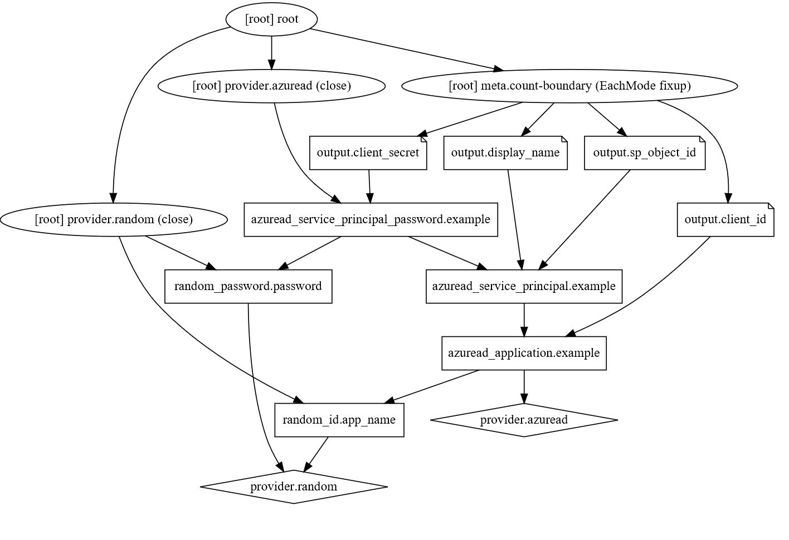
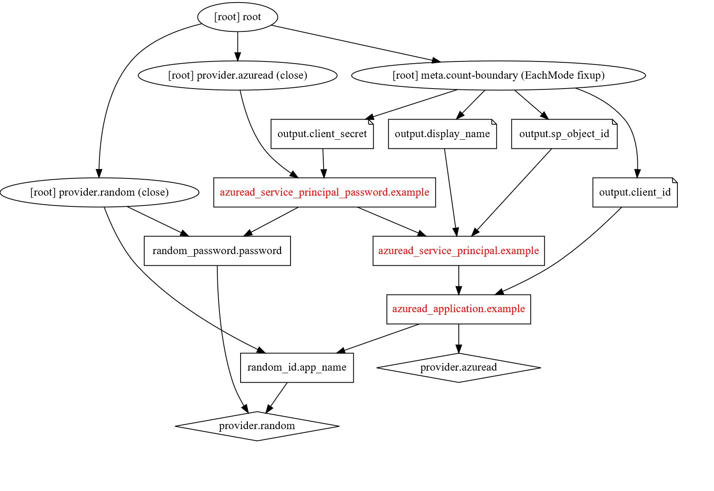

## Visualize Tf resource configuration or execution plan using the Tf Graph

the Graph is great tool to visualize resource dependencies especially useful for complex Tf configurations. The graph can be created by running:
```
terraform graph 
```
For more options like highlighting circular references during creation review the [TF Graph Documentation](https://www.terraform.io/docs/commands/graph.html). The output will be created in the DOT format like:
```
digraph {
        compound = "true"
        newrank = "true"
        subgraph "root" {
                "[root] azuread_application.example" [label = "azuread_application.example", shape = "box"]
                "[root] azuread_service_principal.example" [label = "azuread_service_principal.example", shape = "box"]                "[root] azuread_service_principal_password.example" [label = "azuread_service_principal_password.example", shape = "box"]
                "[root] output.client_id" [label = "output.client_id", shape = "note"]
                "[root] output.client_secret" [label = "output.client_secret", shape = "note"]
                "[root] output.display_name" [label = "output.display_name", shape = "note"]
                "[root] output.sp_object_id" [label = "output.sp_object_id", shape = "note"]
                "[root] provider.azuread" [label = "provider.azuread", shape = "diamond"]
                "[root] provider.random" [label = "provider.random", shape = "diamond"]
                "[root] random_id.app_name" [label = "random_id.app_name", shape = "box"]
                "[root] random_password.password" [label = "random_password.password", shape = "box"]
                "[root] azuread_application.example" -> "[root] provider.azuread"
                "[root] azuread_application.example" -> "[root] random_id.app_name"
                "[root] azuread_service_principal.example" -> "[root] azuread_application.example"
                "[root] azuread_service_principal_password.example" -> "[root] azuread_service_principal.example"                      "[root] azuread_service_principal_password.example" -> "[root] random_password.password"
                "[root] meta.count-boundary (EachMode fixup)" -> "[root] output.client_id"
                "[root] meta.count-boundary (EachMode fixup)" -> "[root] output.client_secret"
                "[root] meta.count-boundary (EachMode fixup)" -> "[root] output.display_name"
                "[root] meta.count-boundary (EachMode fixup)" -> "[root] output.sp_object_id"
                "[root] output.client_id" -> "[root] azuread_application.example"
                "[root] output.client_secret" -> "[root] azuread_service_principal_password.example"
                "[root] output.display_name" -> "[root] azuread_service_principal.example"
                "[root] output.sp_object_id" -> "[root] azuread_service_principal.example"
                "[root] provider.azuread (close)" -> "[root] azuread_service_principal_password.example"
                "[root] provider.random (close)" -> "[root] random_id.app_name"
                "[root] provider.random (close)" -> "[root] random_password.password"
                "[root] random_id.app_name" -> "[root] provider.random"
                "[root] random_password.password" -> "[root] provider.random"
                "[root] root" -> "[root] meta.count-boundary (EachMode fixup)"
                "[root] root" -> "[root] provider.azuread (close)"
                "[root] root" -> "[root] provider.random (close)"
        }
}
```

### Visualize the graph using DOT

to use DOT to visualize the graph - download [GraphViz](http://www.graphviz.org/) for your OS

The following command will create an svg file from the above digraph which as has been saved as *tf_graph_input*

```
dot -Tsvg tf_graph_input -o tf_graph_out.svg
```


### Highlight specific components of the graph

In practice a graph can get quickly hard to read. To spot entities you are interested in I have used a simple pattern to colorize these by changing the font color of the entity to red. To do so just open *tf_graph_input* in VSCode or any other editor and add *fontcolor = "red"* to the object: 

```
"[root] azuread_application.example" [label = "azuread_application.example", shape = "box", fontcolor = "red"]
```


This way the dependencies you are interested in are easier to spot. The [DOT Guide](https://www.graphviz.org/pdf/dotguide.pdf) provides even more options to render the graph differently. Check it out.

#### Resources
* [TF Graph Documentation](https://www.terraform.io/docs/commands/graph.html)
* [GraphViz](http://www.graphviz.org/)
* [DOT Guide](https://www.graphviz.org/pdf/dotguide.pdf)